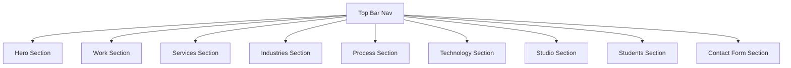

# 🚀 Premium Studio Showcase Website Blueprint
### Strategic Build-Ready Spec: CEO × Marketing × Sales × Senior Developer Perspective

---

## 1. Executive Summary & Positioning (CEO & Sales Perspective)

Most digital studios build portfolio sites that fall into two traps: they are either **clinical dark-mode hacker grids** that scare away normal business clients, or **generic white templates** that fail to interest tech-savvy founders. 

This blueprint defines **OBLIQUE** as an elite, approachable product studio. It captures two distinct audiences:
1. **High-Value Clients (SMEs, Tech Founders, Local Businesses):** Who seek deep engineering credibility, transparent pricing, and structured processes.
2. **Student Capstone / Portfolio Builders:** A high-volume, low-friction pipeline that drives early revenue, establishes community roots, and serves as a testing ground for experimental UI designs.

### Core Strategic Pillars:
* **The "Bright Mode" Default (Not Too Dark):** Instead of an imposing all-black UI, the default theme is a warm, elegant cream/off-white (`#FBF8F3`) with clean typography. A quick-toggle **"Focus Mode"** switch allows visitors to swap to a premium near-black theme.
* **Trust & Honesty:** Every portfolio piece is clearly tagged as a **"Concept Project"** until real client projects launch. This builds immediate trust with senior buyers who appreciate honesty over fabricated case studies.
* **Zero-Friction Lead Funnel:** Client type, budget, and timeline are pre-selected dynamically based on where the visitor clicked. Form data routes straight to your inbox via a managed form service (no backend database required for launch).

---

## 2. Brand Identity & Design Tokens (Senior Dev & Designer Perspective)

The CSS foundation must support clean styling transitions. Paste these design tokens directly into your Tailwind configuration and CSS custom properties:

```json
{
  "brand_identity": {
    "name": "OBLIQUE Creative",
    "theme": "default-light",
    "layout_grid": "12-column Swiss Grid with responsive padding"
  },
  "typography": {
    "display": {
      "family": "Space Grotesk, sans-serif",
      "weights": ["font-medium", "font-bold"],
      "letter_spacing": "tracking-tight",
      "rules": "Used for hero headlines and section titles. Keep leading-none on H1s."
    },
    "body": {
      "family": "Inter, sans-serif",
      "weights": ["font-normal", "font-medium"],
      "line_height": "leading-relaxed",
      "rules": "Base body text. High contrast readability on both backgrounds."
    },
    "mono_label": {
      "family": "DM Mono, monospace",
      "weights": ["font-medium"],
      "letter_spacing": "tracking-[0.16em]",
      "rules": "All-caps labels, category headers, tags, and small eyebrows."
    }
  },
  "colors": {
    "light": {
      "background": "#FBF8F3",
      "surface": "#FFFFFF",
      "surface_elevated": "#F3EEE5",
      "text_primary": "#14141A",
      "text_secondary": "#5B5B66",
      "border": "#E7E1D6"
    },
    "dark": {
      "background": "#0B0C10",
      "surface": "#15161C",
      "surface_elevated": "#1C1E26",
      "text_primary": "#F5F4F2",
      "text_secondary": "#9A9AA5",
      "border": "#2A2C36"
    },
    "accents": {
      "indigo_primary": "#4F46E5",
      "coral_cta": "#FF6B57",
      "coral_hover": "#E05A47",
      "amber_student": "#FFB627",
      "teal_metrics": "#0EA5A0",
      "violet_tech": "#8B5CF6"
    }
  }
}
```

---

## 3. Single-Page Architecture

All components have been unified inside `index.html` to allow seamless momentum scrolling and scroll reveals.



### Components Implemented:
1. **Header & Navigation:** Includes logo, scroll links, theme switch toggle, and Call-To-Action (CTA).
2. **Hero:** Masked headers and introductory blurb about [STUDIO NAME] capabilities.
3. **Marquee:** Floating infinite text strip highlighting Strategy, Design, Engineering, and AI.
4. **Work (Grid):** Category filtering tabs (All, Web, Mobile, SaaS, AI/Tech) with scale transitions.
5. **Services (Grid):** Description cards detailing Discovery, App Development, AI Integration, and MVP Sprints.
6. **Industries (Cards):** Sector picker cards. Clicking any card automatically pre-selects the context dropdown in the contact form and smooth scrolls to the form.
7. **Process (Timeline):** Explains Discover, Define, Design, Build, and Ship phases.
8. **Technology (Architecture):** Frontend, backend, and infrastructure stacks.
9. **Studio (Values):** Trust-building narrative (Senior-only commitment, craft Moat).
10. **Students (Proposals):** Target section for Capstone project mentoring and student pricing.
11. **Contact Form:** Inline validation, honeypot spam protection, and preloading behaviors.

---

## 4. Form Setup & Lead Routing

We configured the lead funnel to use **Formspree** or **Web3Forms**.

### Inquiry Form Logic
1. **Dynamic Pre-Fill:** Read card selections:
   ```javascript
   function selectSegment(segmentVal) {
     const select = document.querySelector('select[name="segment"]');
     if (select) {
       for (let option of select.options) {
         if (option.value.toLowerCase().replace(/[^a-z0-9]/g, '') === segmentVal.toLowerCase().replace(/[^a-z0-9]/g, '')) {
           select.value = option.value;
           break;
         }
       }
     }
   }
   ```
2. **Bot Honeypot Field:** Includes a visually hidden input named `website`. If filled, submissions drop instantly.
3. **Submission Endpoint:**
   * Replace the simulator inside the submission handler with:
     ```javascript
     fetch('https://formspree.io/f/YOUR_ENDPOINT_ID', {
       method: 'POST',
       body: new FormData(form),
       headers: { 'Accept': 'application/json' }
     });
     ```

---

## 5. Build Verification Checklist

Verify:
- [ ] Theme toggler saves preference in `localStorage`.
- [ ] Portfolio filters properly show and hide cards based on selected tags.
- [ ] Clicking any sector card scroll-targets the form and sets the dropdown value correctly.
- [ ] Form validates empty inputs inline using standard HTML5 validity reporting.
